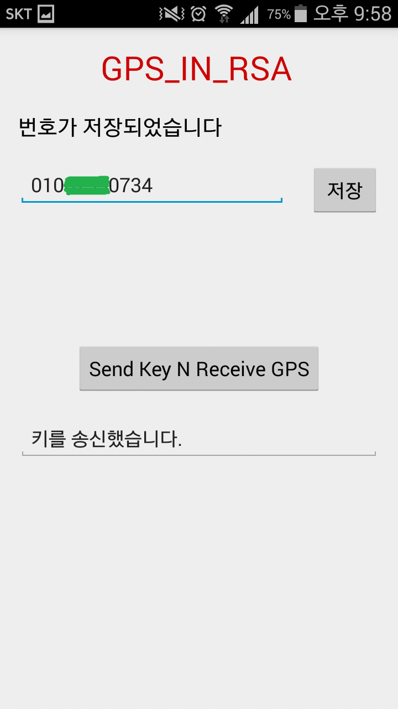

# GPS in RSA

개요
-------------
GPS정보보안을 강화하기 위해 GPS정보에 RSA암호화 기법을 적용한 앱입니다.
모바일의 GPS정보를 암호화하여 암호문을 SMS로 전송합니다.
받은 SMS를 복호화하여 평문으로 변환합니다.

+ JAVA
+ Android Studio
+ GPS제어 및 주소변환
+ SMS송수신 
+ RSA알고리즘 적용

실행 결과
-------------
+ 처음 실행 화면		+ 번호 입력	

  
	

+

  

+

  

+

  

+

  

+

  

클래스 설계
-------------
+ MainActivity.java
<pre><code>
private TextView R_numberText; 	// 번호 입력 TextView
private EditText R_Editnumber; 	// 번호 입력 EditText
private Button R_Check;         // Check
private Button Send;            // Send
private EditText R_Text;        // 상태 메세지, 주소 출력
private String R_string_number;	// 번호 저장 변수
private GpsInfo gps;            // GPS 클래스
private RSA rsa;                // RSA 클래스
private String PlainText;       // 평문
private String ResultText_C;  	// 위도 복호화텍스트 저장
private String ResultText_L;   	// 경도 복호화 텍스트 저장
private int count;              // 진행 상태 count
private int count2;             // 진행 상태 count
public final static String BROADCAST_FINISH = "finish";

private final BroadcastReceiver finishReceiver = new BroadcastReceiver()	// SMS 받았을 때
protected void onCreate(Bundle savedInstanceState)	
private void sendSMS(String sendNumber, int numbering)		// SMS 전송 (보낼 번호, 진행상태)
public void pushGPSinfo(String s)				// 위도 경도 값을 잘라 주소를 출력
</code></pre>

+ ReceiveSMS.java
<pre><code>
public void onReceive(Context context, Intent intent)	// SMS 수신 시, 전화 번호와 메세지 저장
</code></pre>

+ GpsInfo.java
<pre><code>
private final Context mContext;
Location location;      // GPS go
double lat;             // 위도
double lon;             // 경도
private static final long MIN_DISTANCE_CHANGE_FOR_UPDATES = 10;	// 최소 GPS 정보 업데이트 거리 10미터    
private static final long MIN_TIME_BW_UPDATES = 1000 * 60 * 1;	// 최소 GPS 정보 업데이트 시간 밀리세컨이므로 1분
protected LocationManager locationManager;	// GPS 매니저
private boolean isGPSEnabled = false;		// 현재 GPS 사용 유무
private boolean isNetworkEnabled = false;	// 네트워크 사용 유무
private boolean isGetLocation = false;		// GPS 상태값

public GpsInfo(Context context)		// 생성자
public Location getLocation()		// GPS 반환
public double GetLatitude(){		// 위도 반환
public double GetLongitude(){		// 경도 반환
public void changeLocation(String n)	// 위도, 경도 값에서 위도 경도를 나누고 소수점 복구
public String GetAddress(){		// 위도, 경도 정보로부터 주소 변환
</code></pre>

+ RSA.java
<pre><code>
private KeyPair clsKeyPair;  	// public key, private key 쌍
private Key clsPublicKey;  	// public key
private Key clsPrivateKey;  	// private key
private RSAPublicKeySpec clsPublicKeySpec;  	// 실질적인 public key (module과 exponent)
private RSAPrivateKeySpec clsPrivateKeySpec;   	// 실질적인 private key (module과 exponent)
// encrypt 관련
String strCipher;   // 바이트화 한 것을 다시 String으로 - 암호문
// decrypt 관련
String strResult;   // 바이트화 한 평문을 String으로 - 평문
// generate key
private BigInteger publicKeyModule;
private BigInteger publicKeyExponent;
private BigInteger privateKeyModule;
private BigInteger privateKeyExponent;
	
public void pushPublicKey(String s, int numbering)
public String getPublicKeyExponent()	// biginteger를 plaintext로 변환
public String getPublicKeyModule()
public String getStrCipher ()		// strCipher 반환
public String getStrResult ()		// strResult 반환
public void GenKey ()			// public key, private key 생성
public void encrypt (String plaintext)		// 암호화
public void decrypt (String encryp_text)	// 복호화
</code></pre>
